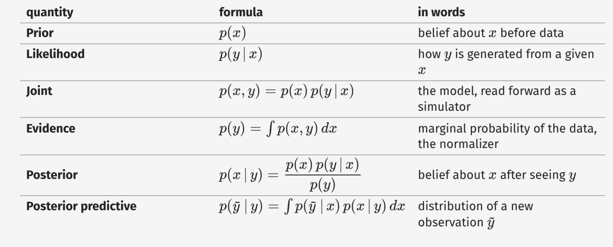

[Link al Libro](https://arxiv.org/pdf/1809.10756)


clase 01: 1

clase 02: 2.1, 2.2, 4.1 

clase 03: 4.2, 3.2

clase 04: 4.3

clase 05: 5,6

Justin Dunke graphical models

# Capitulo 1: Introducción

## 1.1: Razonamiento basado en Modelos

Un modelo es una construccion artificial diseñada para responder de forma idéntica al sistema que se quiere entender.

Los modelos numéricos y simulaciones por computadora reemplazaron los modelos físicos y son por naturaleza aproximaciónes. Dichos modelos numéricos emulan la estocacidád utilizando generadores pseudoaleatorios de numeros para simular fenómenos _random_.

Llammos **observaciones** a aquellos valores producidos por los modelos y que son medibles en el mundo real. 

### 1.1.1: Denotación de Modelos

Un ejemplo de modelo estadístico es el modelo beta-Bernoulli para simular el giro de una moneda, típicamente denotado como

$$x \sim \text{Beta}(\alpha, \beta)$$

$$y \sim \text{Bernoulli}(x)$$

En este contexto α y β son parámetros, x es una variable latente e y es el valor resultante de girar la moneda.

> Una variable latente es aquella que se elije de un rango de valores con algún típo de distribución, algo así como una variable "al azar".


### Regla de Bayes

Esta regla nos indica cómo derivar una probabilidad condicional, condicionar nos indica cómo actualizar nuestras creencias.

$$p(X|Y) = \frac{p(Y|X)p(X)}{p(Y)}$$

Alguas aclaraciones:

-   $ p(X|Y) $ es el _likelihood_ (o probabilidad de verosimilitud) <br> _**La probabilidad de que ocurra X sabiendo que ocurrió Y**_
-   $ p(X) $ es el _prior_ (o probabilidad a priori) <br>
    _**La probabilidad de que ocurra X antes de analizar Y**_
-   $ P(Y)$ es el _marginal likelihood_ (o verosimilitud marginal) <br>

-   $ P(Y|X)$ es el _posterior_ (o probabilidad a posteriori) <br>
    _**La probabilidad de que ocurra X despues de analizar Y**_
-   $ P(X,Y)$ es el _joint likelihood_ (o verosiomilitud conjunta)
    _**La probabilidad de que ocurran X e Y a la vez**_



### Condicionamiento

Condicionar es parametrizar una distribución, recordemos que tenemos **P(X|Y)** _(o la probabilidad de que, dado Y, ocurra X)_, condicionar sería el acto de fijar el valor de Y para obtener una distribución específica de X según el valor fijado de Y.

En el contexto del giro de moneda teníamos la **variable latente X** que representaba el **_bias_** de la moneda (la probabilidad de que la moneda caiga en cara o seca) y la **variable Y** que representa el **valor resultante del giro**.

A partir de eso aplicar el condicionamiento P(X|Y = _heads_) nos permite actualizar el _bias_ de la moneda, dado que cayó en cara la curva de probabilidad cara/seca debe inclinarse levemente más a cara. 

## 1.2: Programación Probabilística

## 1.4: Primer Programa Probabilistico

## 1.5: Primer Evaluador de Programa Probabilístico


# Capitulo 2: Lenguaje Probabilístico Sin Recursión

Lenguaje de Programación Probabilistica de Primer Orden (FOPPL)

## 2.1: Syntax

### General

| Regla | Descripción |
| :--- | :--- |
| **$v$** | Variable _(references value of another expression in the program)_ |
| **$c$** | Constant value _(number, str, bool, vector...)_ or primitive operation _(+...)_ |
| **$f$** | Procedure |
| **$e $** | $c$ \| $v$ \| <br> `(let [v e1] e2)` _(assigns **e1** to **v**, can be accessed in **e2**)_ <br> \| `(if e1 e2 e3)` _(if (**e1**) **e2** else **e3**)_ <br> \| `(f e1 ... en)` _(f(**e1**,...,**en**))_ <br> \| `(c e1 ... en)` _(same as f, but c is primitive function)_ <br> \| `(sample e)` _(returns a sample value from e, which has to be a distribution object)_ <br>\| `(observe e1 e2)` _(e1 has to be a distribution, e2 is the actual value used for conditioning)_|
| **$q $** | $e$ \| `(defn f [v1 ... vn] e) q` |

> Un programa _q_ puede ser una única expresión _e_ o una función <br> _(defn f ...)_ seguida por cualquier programa _q_.

### Vectores
-   `(first e)` First element of a list/vector ***e***
-   `(rest e)` Tail of a list/vector ***e***
-   `(last e)` last element of list/vector ***e***
-   `(append e1 e2)` appends ***e2*** to the end of ***e1***
-   `(get e1 e2)` retrieves element at index/key ***e2*** from list/vector/hashmap ***e1***
-   `(put e1 e2 e3)` replaces element at index/key ***e2*** with value ***e3*** in vector/hashmap ***e1***
-   `(remove e1 e2)` removes element at index/key ***e2*** in vector/hashmap ***e1***

>! IMPORTANTE: Structure modifications do NOT happen in-place but rather are RETURNED as MODIFIED COPIES

### Ejemplo

Veamos un ejemplo de regresión lineal. En líneas generales lo que busca este código es definir una distribucion de lineas expresadas en términos de sus pendientes y ordenadas al origen, esto se logra armando una distribución a _priori_ y despues se usan 5 datapoints para condicionar.

```clojure
(defn observe-data [slope intercept x y] ;
  (let [fx (+ (* slope x) intercept)]
    (observe (normal fx 1.0) y)))

(let [slope (sample (normal 0.0 10.0))]
  (let [intercept (sample (normal 0.0 10.0))]
    (let [y1 (observe-data slope intercept 1.0 2.1)]
      (let [y2 (observe-data slope intercept 2.0 3.9)]
        (let [y3 (observe-data slope intercept 3.0 5.3)]
          (let [y4 (observe-data slope intercept 4.0 7.7)]
            (let [y5 (observe-data slope intercept 5.0 10.2)]
              [slope intercept])))))))
```

- `observe-data` es una función que toma un par (x,y) y condiciona al modelo observando el valor de y.

- El nido de `let` define una pendiente y _oo_ al azar de una distribución normal, despues se condiciona con los 5 datos para tener una distribución posterior en base a los mismos.

### 2.2.1: Let forms

Como se ve en el ejemplo anterior, las funciones `Let` son bastante engorrosas ya que solo permiten declarar una variable por llamado, es por esto que se puede generalizar usando 

```clojure
    (let [v1 e1
        ;...
        ;...
        vn en
    ]
    en+1 ... em)
```

Por otro lado tambien esta bueno notar que la función observe(e1 e2) retorna siempre e2 despues de condicionar e1, entonces originalmente teniamos un monton de variables yn que no sirven para nada, podemos aplicar algo similar a haskell/python y hacer 

```clojure
    (let [ _ ( observe ( normal 0 1) 2.0)] . . .)
```

### 2.2.2: For loops

En simultaneo podemos ver del ejemplo que repetir la función (observe-data ...) es engorroso y por lo tanto usar un for loop nos ayuda bastante

```clojure
    (foreach c
    [v1 e1 ... vn en]
    e1 ... ek)
```

Entonces reescribiendo el ejemplo optimizado con for loops y Let

```clojure
    (let [  y-values [2.1 3.9 5.3 7.7 10.2]
            slope ( sample ( normal 0.0 10.0))
            intercept ( sample ( normal 0.0 10.0))]
        (foreach 5
            [ x (range 1 6)
              y y-values]
            (let [ fx (+ (* slope x ) intercept )]
                ( observe ( normal fx 1.0) y )))
        [slope intercept])
```


# Captiulo 3

## 3.2: Evaluating Density


# Capitulo 4

## 4.1: Likelihood Weighting

Es uno de los metodos de inferencia basados en evaluación más simples. 

### 4.1.1: Importance Sampling

Importance sampling aproxima la distribución posterior p(X|Y) usando samples. El truco es cambiar el saple 

Que operaciones tienen que hacerse

Como implementar likelihood weighting

Como implementar importance sampling corriendo un programa muchas veces


## 4.2: Metropolis-Hastings

Son metodos que generan una cadena de Markov de los valores retornados por programas $\text{r(X)}^{1}\text{,...,r(X)}^{\text{S}}$ aceptando o rechazando samples según un algoritmo

  1. Inicializa un resultado r con una "calidad" W
  2. En cada paso genera un nuevo resultado r' con una calidad W'
  3. Compara las calidades y si el nuevo es mejor lo adopta, si es peor le da una oportunidad según que tan malo sea
  4. Si el nuevo resultado es rechazado se queda con el anterior  


### 4.2.1: Single-Site Proposals

Es la idea de no recalcular todas las variables aleatorias para incrementar la probabilidad de aceptación de un nuevo resultado.

  1. Se define una única variable a recalcular
  2. Copia el resto de variables de la ejecución anterior
  3. Corre el programa usando las copias y recalculando variable elegida
  4. Resuelve y decide si se queda con el cambio o descarta (usando una cuenta llamada _acceptance ratio_)


## 4.3 Sequential Monte Carlo

Esta iteración del algoritmo de likelihood weighting busca optimizar la eficiencia con la cual generamos los valores de las variables al azar. 

- El problema: Cuando tenemos muchas variables es poco probable que podamos hacer que todas tengan un buen valor simultáneamente.
- La proposición: Separar en subconjuntos más pequeños para incrementar la probabilidad de buenos valores simultáneos.

Para esto se introduce la función $\text{PROPOSE(}\text{X}_{\text{n}-1}\text{,y}_{\text{n}})$ que evalúa un programa hasta la expresión observe en la direccion $\text{y}_{n}$ condicionado por los valores sampleados $\text{X}_{n-1}$ y retorna un par $(\text{X}_{n},\text{log} \Lambda_n)$ donde

- $\text{X}_n$ es un diccionario con pares expresión `sample`: valor
- $\text{log} \Lambda_n$ contiene el likelihood logarítmico = $\text{log p(}\text{Y}_{n} | \text{X}_n)$


# Capitulo 5: Recursive Probabilistic Languages


## 5.1: Syntax

| Regla | Descripción |
| :--- | :--- |
| **$v$** | Variable _(references value of another expression in the program)_ |
| **$c$** | Constant value _(number, str, bool, vector...)_ or primitive operation _(+...)_ |
| **$f$** | Procedure |
| **$e $** | $c$ \| $v$ \| $f$ <br> \| `(let [v e1] e2)` _(assigns **e1** to **v**, can be accessed in **e2**)_ <br> \| `(if e1 e2 e3)` _(if (**e1**) **e2** else **e3**)_ <br> \| `(f e1 ... en)` _(f(**e1**,...,**en**))_ <br> \| `(c e1 ... en)` _(same as f, but c is primitive function)_ <br> \| `(sample e)` _(returns a sample value from e, which has to be a distribution object)_ <br>\| `(observe e1 e2)` _(e1 has to be a distribution, e2 is the actual value used for conditioning)_|
| **$q $** | $e$ \| `(defn f [v1 ... vn] e) q` |


## 5.3: Examples

### 1.  Rejection-Sampling 

  Este es un ejemplo de recusión particularmente útil a la hora de armar distribuciones subjetivas, lo que se hace es utilizar una distibución conocida y luego aplicar un filtro particular.
  ```clojure
    (defn rejection-sample [proposal is-valid?]
      (let [value ( proposal )]
        (if (is-valid? value)
          value
          (rejection-sample proposal is-valid?))))
  ```

### 2. Map 

Un típico map de cualquier lenguaje, aplica una función f a una lista de manera recursiva
```clojure
  (defn map [f values])
    (if (empty? values))
      values
      (prepend (map f (rest values)))
          (f (first values))
```

# Capitulo 6: Inference Across Messaging Interface

La idea es que el código es ejecutado po un programa determinístico hasta alcanzar una expersión de tipo `sample` u `observe`, en cuyo caso toma control un controlador de inferencia que implementa operaciones probabilísticas y estocásticas.

## 6.1: Explicit separation

Se interactua mediante un protocolo de mensajes, donde el controlador de inferencia le indica al programa si debe continuar, forkearse o frenar.

En el caso de likelihood weighting nunca hay forkeos ni stops, simplemente se corre el programa en su totalidad

Por otro lado, en el caso de Sequential Monte Carlo tenemos mensajes con argumentos para identificar procesos particulares, como ("start", $\sigma$),("fork", $\sigma, \sigma'$,c), ("kill", $\sigma$) en dirección controlado -> programa y ("sample", $\sigma, \alpha$,d), ("observe", $\sigma, \alpha$,d,c) 


## 6.2: Addressing Transformation

Necesitamos tener una foma de identificar el punto actual de ejecución, en particular cualquier `sample` y `observe`, es importante notar que, dado que los HOPPLS pueden evaluar una cantidad sin límites de dichas operaciones, nuestra generación de direcciones debe poder crearlas at run time.


## 6.3: Continuation-Passing-Style Transformation (CPS Transformation)

La transformación CPS lineariza un computo en una secuencia de pasos computacionales. La idea es básicamente que cada "continuation" representa las expresiones que fueron evaluadas hasta ahora y las expresiones que le faltan para completar el cómputo. 

Estas continuaciones se llaman en cada `sample` y `observe` una o múltiples veces según el caso. 


## 6.4: Message Interface Implementation

Se utiliza una arquitectura cliente-servidor entre los programas y el controlador de inferencia.


# Capitulo 7: Inference in Differentiable Models

Este capitulo se centra en un intermedio entre los HOPPL y FOPPL (en particular del sistema Stan). La idea del middle ground es utilizar un lenguaje de alto nivel estáticamente tipado y con variables declaradas en compile time, esto logra que sepamos exactamente que variables el programa va a instanciar pero que su función de densidad asociada se computa dinámicamente at run time.

Una restricción que surje a partir de los métodos de inferencia basados en la gradiente es la imposibilidad de utilizar variables discretas.

## 7.1: Higher-order Probabilistic Programs with Static Support

### 7.1.1: Static Addressing in HOPPL

Los programas Stan no pueden crear variables al azar dinámicamente, podemos ver que significa esto usando una variante de HOPPL idéntica a la original pero con una modificación en la manera de declarar variables aeatorias.

| anterior | nuevo |
| :----- | :---- |
| `(sample e)` | `(sample v e)` |

Esto fuerza una única dirección acorde al nombre de la variable y por lo tanto una cantidad finita de variables aleatorias y facilitando la implementación de inferencia.


### 7.1.2: Computing Unnormalized Density as a Side Effect

Funcion de potencial energia de un programa

$$ \text{U(X)} = - \text{log}\gamma(X)$$

Esta energia se calcula mediante una traducción de las expresiones estáticamente addressed a una funcion que acepta las variables libres _X_ como inputs y calcula el valor de retorno _v_ y su _potential energy_. 

- Caso `(observe d y)`: disminuimos la _potenial energy_ por LOG-PROB(d,y) y retornamos y.

- Caso `(factor c)`: disminuimos la _potential energy_ por c y no retornamos nada.


## 7.2: Hamiltonian Monte Carlo

Es un algoritmo de MCMC (Monte Carlo Markov Chain) que usa el gradiente para construir un kernel de transición. 


# 8: Deep Learning 


## 8.1: Programs as Deep Generative Models


Los programas que definen modelos generativos son idénticos a los anteriores con el detalle de aceptar redes neuronales como funciones primitivas (aunque esto siempre se puede lograr via implementaciones matemáticas).

### 8.3

La parte más importante de los programas que definen modelos generativos: the ability to partially specify the generative model; encoding the parts of the model you do know, and letting model
learning and generic deep neural network function approximation take
care of the rest.


Guide defines how candidate latent executions are proposed


Reparametrizacion
---

Distribucion base (ej normal 0 1)

u = normal(0,1)

r = 3 u + 5 -> normal(5, 3)


Variational Autoencoders
---

p(z) -> prior

p_tita(x|z) -> verosimilitud, encoder

q_phi(z|x) -> guía, decoder


Gradiente 
---
Derivada respecto a un parametro


