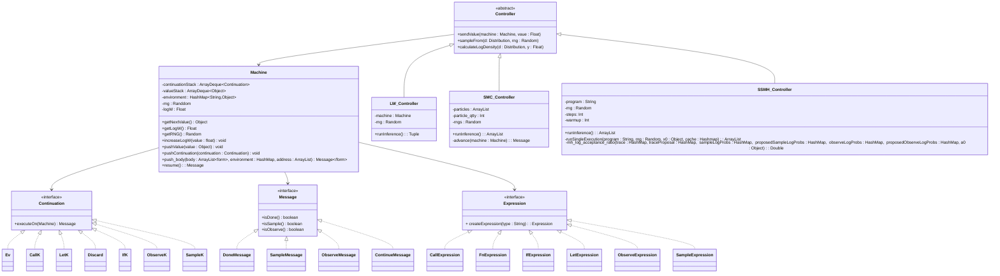

```mermaid
classDiagram
    class Continuation {
        <<interface>>
        +executeOn(Machine) Message
    }
    class Ev
    class CallK
    class LetK
    class Discard
    class IfK
    class ObserveK
    class SampleK
    Continuation <|.. Ev
    Continuation <|.. CallK
    Continuation <|.. LetK
    Continuation <|.. Discard
    Continuation <|.. IfK
    Continuation <|.. ObserveK
    Continuation <|.. SampleK

    class Message {
        <<interface>>
        +isDone() boolean
        +isSample() boolean
        +isObserve() boolean
    }
    class DoneMessage
    class SampleMessage
    class ObserveMessage
    class ContinueMessage
    Message <|.. DoneMessage
    Message <|.. SampleMessage
    Message <|.. ObserveMessage
    Message <|.. ContinueMessage

    class Expression{
        <<interface>>
        + createExpression(type : String) : Expression
    }
    class CallExpression
    class FnExpression
    class IfExpression
    class LetExpression
    class ObserveExpression
    class SampleExpression
    Expression <|.. CallExpression
    Expression <|.. FnExpression
    Expression <|.. IfExpression
    Expression <|.. LetExpression
    Expression <|.. ObserveExpression
    Expression <|.. SampleExpression


    class Machine {
        -continuationStack : ArrayDeque~Continuation~
        -valueStack : ArrayDeque~Object~
        -environment : HashMap~String,Object~
        -rng : Randdom
        -logW : Float
        
        +getNextValue() Object
        +getLogW() Float
        +getRNG() Random

        +increaseLogW(value : float) void
        +pushValue(value : Object) void
        +pushContinuation(continuation : Continuation) void
        +push_body( body : ArrayList<Form>, environment : HashMap<String, Object>, address : ArrayList<Object> ) Message
        +resume() : Message

    }
    Machine --> Continuation
    Machine --> Message
    Machine --> Expression


    class Controller {
        <<abstract>>
        +sendValue(machine : Machine, vaue : Float)
        +sampleFrom(d: Distribution, rng : Random)
        +calculateLogDensity(d : Distribution, y : Float)
    }
    class LW_Controller{
        -machine : Machine
        -rng : Random

        +runInference() : Tuple<Object,Float>
    }
    class SMC_Controller{
        -particles : ArrayList<Machine>
        -particle_qtty : Int
        -rngs : Random

        +runInference() : ArrayList<Float>
        -advance(machine : Machine) : Message
    }
    class SSMH_Controller{
        -program : String
        -rng : Random
        -steps: Int
        -warmup : Int

        +runInference() : ArrayList<Float>
        -runSingleExecution(program : String, rng : Random, x0 : Object, cache : Hashmap<Object,Object>) : ArrayList<Object>
        -mh_log_acceptance_ratio( trace : HashMap<Object,Object>, traceProposal : HashMap<Object,Object>,  sampleLogProbs : HashMap<Object,Float>,  proposedSampleLogProbs : HashMap<Object,Float>,  observeLogProbs : HashMap<Object,Float>,  proposedObserveLogProbs : HashMap<Object,Float>, a0 : Object) : Double
    }
    Controller <|-- LW_Controller
    Controller <|-- SMC_Controller
    Controller <|-- SSMH_Controller
    Controller --> Machine

```