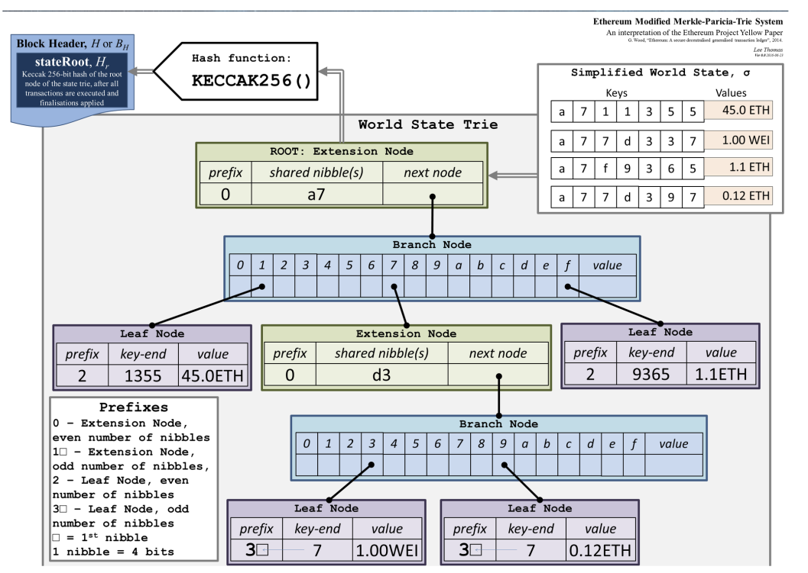

# Smart transactions
_Note: pending transactions are those that are either currently in the mempool or those that have been added too recently to the blockchain._
## Ethereum
Ethereum can be viewed as a transaction block based machine where each a transaction block represents a valid arc between two states, the world state is a mapping between address and account state, we have 2 **account types**:
- Externally owned account: the account state contains the nonce and balance, this is accessed via private key and address
- Contract account: containts nonce, balance, storage hash, code hash, the contract is controlled by (and contains) EVM code

The concept of _Gas_ is the fuel to process a block, namely the fuel of the computation power.

### Transaction fields:
1. nonce 
2. gasPrice 
3. gasLimit 
4. to 
5. value 
6. v,r,s 
7. init(or data)

### Merkle Patricia Trie
It's a key-value state tree where the address is the key and the Balance,Nonce,StorageRoot,codeHash is the value.  
However, we also need to add some modifications such as easy editing, limited depth and making the root dependant on the data and not the update order.  
This trie will 

